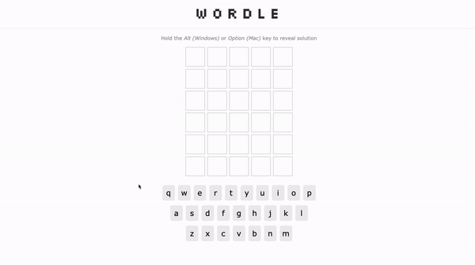

# react-wordle

A fun and highly-addictive mini project that replicates the popular word-guessing game Wordle.

## Running the Application
1. **Start the client :**
```bash
npm start
```
This will start the React application on http://localhost:3000

2. **Start the local server :**
```bash
json-server ./data/db.json --port 4000
```
This will start the JSON server on http://localhost:4000.

3. **Enjoy the Game!**

Head over to http://localhost:3000 to start playing.

## Live Demo
